# Diggy 🪄

**A live, animated VRM avatar that actually works the web for you** — it lives in the corner of
your browser, talks to you, fills forms from an encrypted profile, watches job/result pages and
your Gmail, and reminds you before deadlines hit.

<p align="center">
  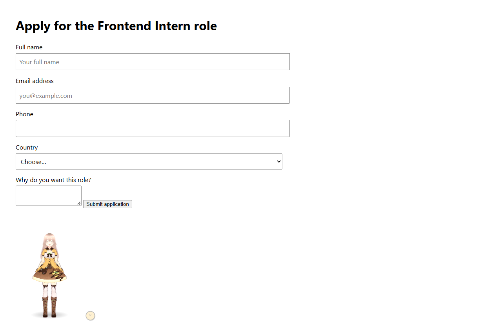
</p>

<p align="center">
  
  
  
  
  
</p>

---

## ✨ What it does

| | Feature |
|---|---|
| 🧍 | **Animated VRM avatar** — walks in from the corner, idles (breathing/blink/sway), emotes, lip-syncs, walks out. |
| 🎙 | **Push-to-talk voice** — hold `Ctrl+Shift+Space`, speak, release. Transcribed by **Groq Whisper** (works in Chrome *and* Edge). |
| 💬 | **Tool-calling brain** — reads pages, searches the web, crawls, fills forms, sets reminders, reads Gmail/Calendar. |
| 🃏 | **Rich cards** — link previews with the site's real logo, **YouTube video cards** (thumbnail + ▶ Play), and **page snapshots** after a fill. |
| 🧩 | **One-click plugins** — sign in once, then **Connect Notion / Gmail / Calendar / GitHub** with a single click. No URLs, no keys. |
| 🔁 | **Automatic provider failover** — if Groq hits its limit it instantly switches to NVIDIA, and back. |
| 🖊️ | **Generic form autofill** — detects fields on *any* website and maps them to your profile (never auto-submits). |
| 🔐 | **Encrypted vault** — your profile is AES-256-GCM (Argon2id KDF) and never leaves the browser. |
| ⏰ | **Reminders** — real alarms, native notifications, spoken by the avatar. |
| 👀 | **Watch the web** — monitor up to 10 pages for changes or a keyword; it pings you the moment something shows up. |
| 🔗 | **Gmail + Calendar** — zero-setup inbox/calendar watching (or full OAuth), announces important mail excitedly. |
| 🖥️ | **Desktop companion** — a Tauri app with a transparent always-on-top overlay + a local WS bridge. |
| 🕷️ | **Crawler service** — pluggable Firecrawl / Crawl4AI / browser-use adapters, plus a built-in Playwright crawler and keyless search. |

---

## 📸 Screenshots

### The bot, on a real page
<p align="center"></p>

### The avatar engine
| Idle | Walking in | Thinking | Celebrating |
|---|---|---|---|
| 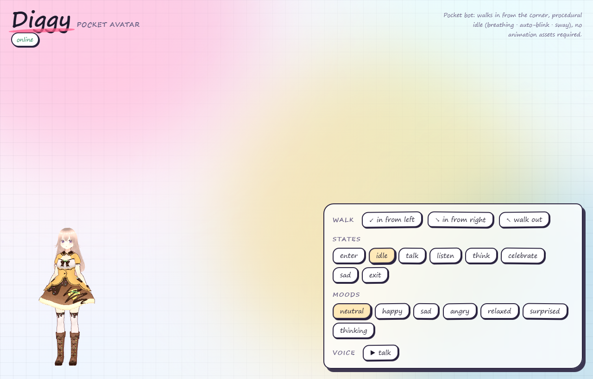 | 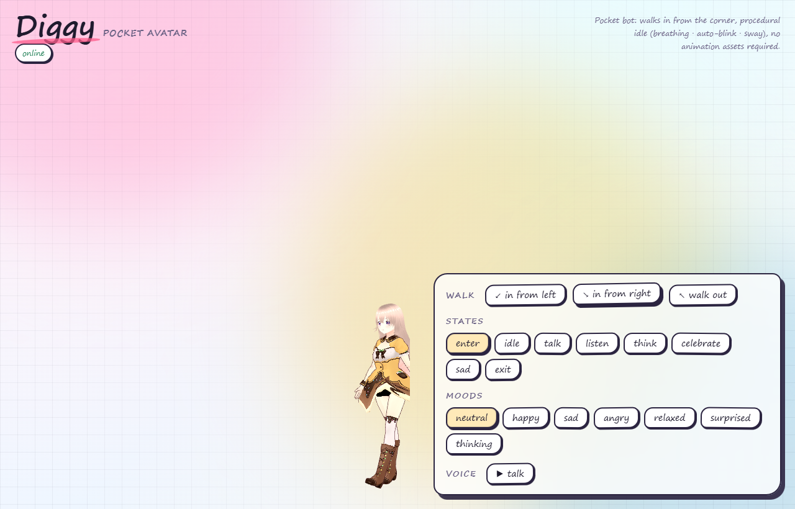 | 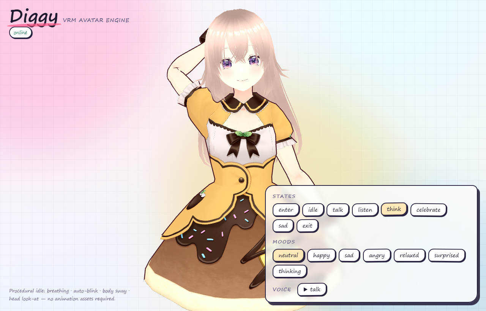 | 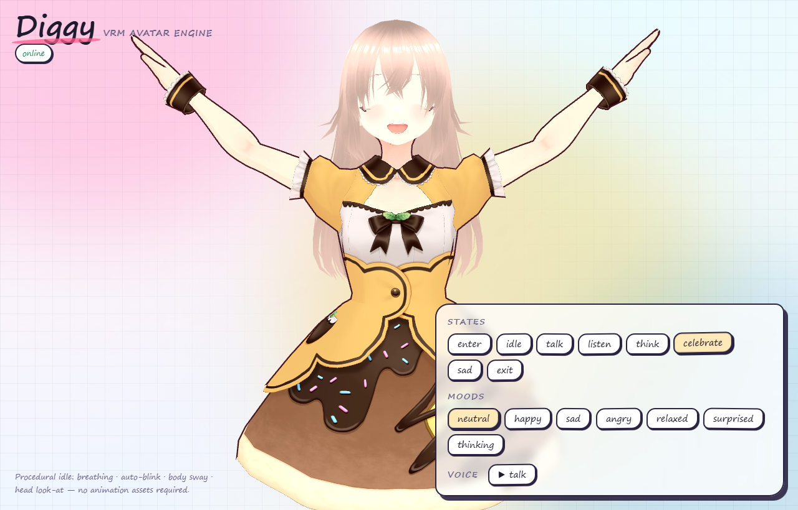 |

### The side panel
| Chat (with a live reply) | 🔐 Profile vault | ⏰ Reminders |
|---|---|---|
| 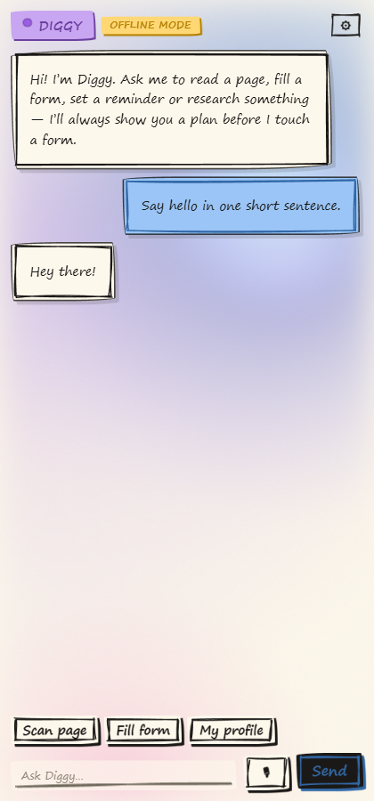 | 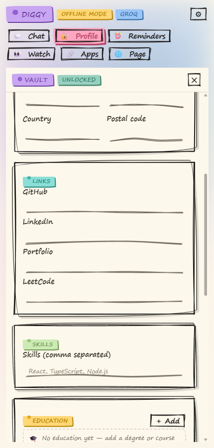 | 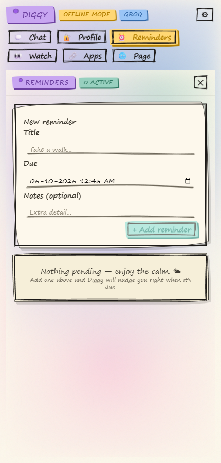 |

| 👀 Watch the web | 🔗 Apps (Gmail + Calendar) | 🌐 Live page |
|---|---|---|
| 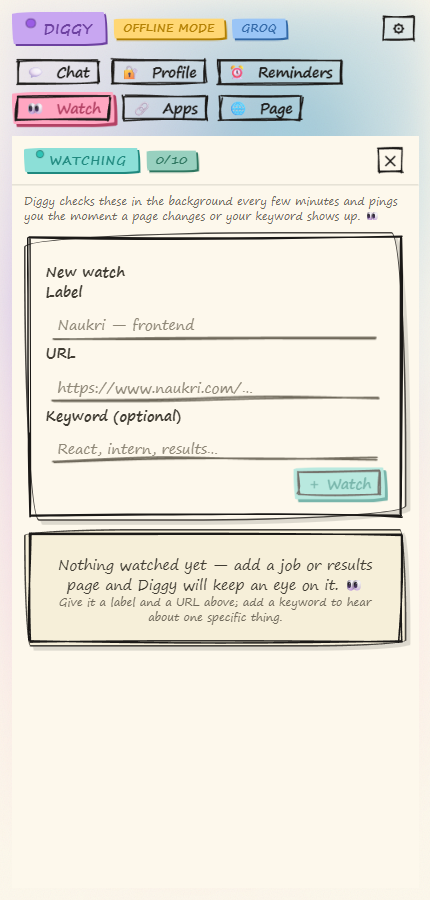 | 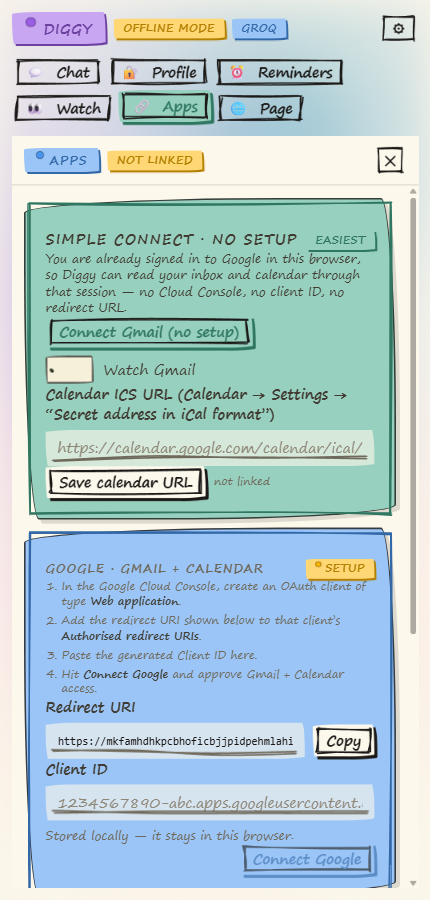 | 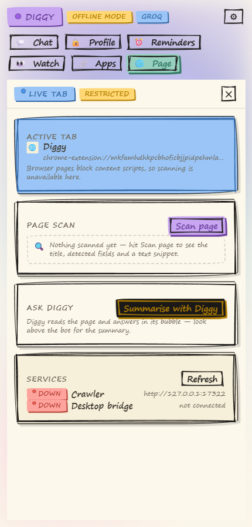 |

---

## 🧱 Monorepo layout

```
diggy/
├─ assets/avatar/           the VRM model (single source of truth)
├─ packages/
│  ├─ shared/               types + the extension⇄desktop bridge protocol
│  ├─ avatar/               three.js + @pixiv/three-vrm engine, state machine, lip-sync
│  ├─ core/                 provider abstraction (Groq / NVIDIA NIM), orchestrator, tools
│  ├─ vault/                Argon2id + AES-256-GCM encrypted profile
│  └─ ui/                   pen-sketch design system (rough.js, Tailwind preset)
├─ apps/
│  ├─ extension/            Chrome/Edge MV3: content script, side panel, offscreen mic, overlay
│  ├─ desktop/              Tauri v2 shell (transparent always-on-top overlay) + Rust supervisor
│  └─ demo/                 tiny Vite playground for the avatar engine
└─ services/
   ├─ crawler/              Fastify research service: extract / crawl / search / markdown
   ├─ api/                  one-click plugin backend: Google sign-in, OAuth, encrypted tokens
   └─ bridge/               Node WebSocket bridge the desktop + extension talk over
```

---

## 🚀 Quick start

```bash
pnpm install          # also syncs the avatar into the apps (postinstall)

pnpm build            # build everything (turbo)
pnpm test             # vault, core, crawler and bridge test suites
```

**Extension (Chrome/Edge):**
1. `pnpm --filter @diggy/extension build`
2. `chrome://extensions` (or `edge://extensions`) → **Developer mode** → **Load unpacked** →
   `apps/extension/.output/chrome-mv3`
3. Open a normal website — Diggy walks into the bottom-left corner. Click the toolbar icon for the
   side panel.

**Voice:** click the 🎙 button in the side panel once (grants the mic), then hold
`Ctrl+Shift+Space` on any page and speak.

**Crawler / research service:**
```bash
pnpm --filter @diggy/crawler start        # http://127.0.0.1:17322
```

**One-click plugins backend:**
```bash
pnpm --filter @diggy/api start            # http://127.0.0.1:17323
```
Side panel → **🧩 Plugins** → *Sign in with Google* → then **Connect Notion / GitHub / Gmail**.
The server holds the OAuth apps and keeps refresh tokens **encrypted**; the extension never sees them.
Register the OAuth apps once (redirect URI `http://127.0.0.1:17323/oauth/<provider>/callback`) — see
[`RUN.md` §7](RUN.md).

**Desktop companion (needs Rust):**
```bash
cd apps/desktop/src-tauri && cargo run
```

**Bridge (works without Rust):**
```bash
pnpm --filter @diggy/bridge start
```
Then paste the token in ⚙ settings and hit **Connect bridge** — the header badge turns
*"Desktop linked"*.

See [`RUN.md`](RUN.md) for the full setup, including the Google (Gmail + Calendar) connection.

---

## 🔒 Security & privacy

- The vault is **AES-256-GCM** with an **Argon2id**-derived key; the key lives only in memory and
  auto-locks. Nothing is uploaded anywhere.
- The LLM only ever receives what a task needs; secrets are excluded from the profile tool.
- **Forms are never auto-submitted** — Diggy always shows a *Fill / Cancel* confirmation.
- The bridge binds `127.0.0.1` only and requires a shared token.
- API keys live in a **gitignored** `apps/extension/.env` — never publish a build made with it.

---

## 🗺️ Status

Working end-to-end today: the avatar engine, the extension (chat + voice + autofill + reminders +
watch + Gmail/Calendar), provider failover, the crawler service and the desktop shell
(`cargo build` + launch verified).

Built with TypeScript, three.js + three-vrm, Chrome MV3, Tauri v2, Fastify, and the Vercel AI SDK's
tool-calling loop.
